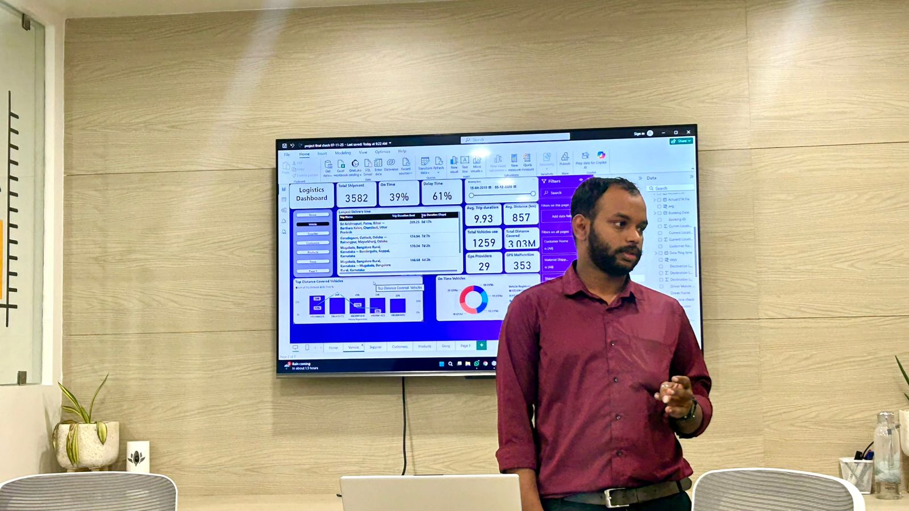
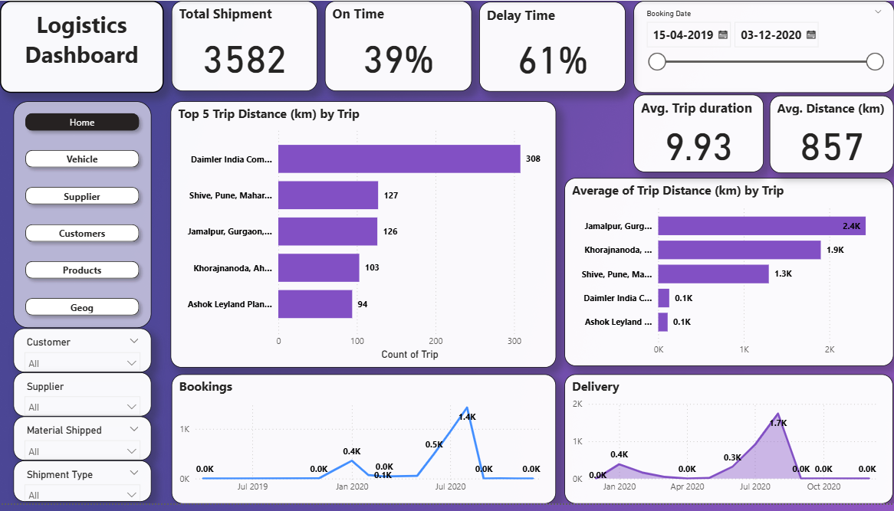

# 👋 Hi, I'm Shakhil M K  
**Data Analyst | Accounting Professional | Data-Driven Decision Making | Transforming Insights into Impact.** 

<!--Section 1: Introduction-->

## 🌟 About Me  
I am an Intern Data Analyst at Rows & Columns and an Accounting Professional with strong skills in **Power BI, Excel, DAX,** and **SQL.** I specialize in building interactive dashboards, automating reports, and supporting data-driven decisions.

With a solid background in **accounting, bookkeeping, and financial reporting**, I work with **P&L, balance sheets, cash flows**, and **reconciliations,** ensuring accurate and insight-driven analysis across business and financial domains.

🚀 Let’s turn data into impactful stories!
---

## 🎓 Education  
- **M.Com- finance (IGNOU)** (Pursuing)
- **CMA- Indian** (Pursuing)
- **B.Com- Finance (University of Calicut)**
- **Diploma in Indian & Foreign Accounting (DIFA)**  

---

## 💼 Work Experience  
### 🔹Intern Data Analyst — **Rows & Columns, Kozhikode** 
- Assisted the analytics team in delivering industry-wide reports using **Power BI** and **Excel**  
- Supported KPI analysis and dashboard development for clients using **Microsoft 365** tools  
- Helped create and maintain automated reporting solutions from multiple data sources  

### 🔹Store Manager - **HAWAII STORE LLP, Kunnamkulam** 
- **Analyse** **sales** and **financial data** to track performance and improve profitability.
- Prepare **operational and management reports to support decision-making**.
- Manage **budgets, expenses, and daily financial transactions**.
- **Lead and evaluate staff performance to enhance productivity and customer service.**

### 🔹Assistant Store Manager - **HAWAII STORE LLP, Kunnamkulam** 
- Monitored **sales metrics and inventory movement** using structured reports.
- Supported **store operations, compliance, and cash management.**
- Assisted in **performance tracking and operational analysis.**

### 🔹Accountant - **HAWAII STORE LLP**
- Prepared **Balance Sheets, P&L, and Cash Flow Statements.**
- Managed **accounts payable and receivable with accuracy.**

  
---

## 📊 Projects  

### 👥 HR Analytics Dashboard – [Power BI | SQL]

- 📊 Analysed employee demographics, including gender distribution and hiring trends across departments.
- 💰 Evaluated salary trends and distributions by job title and department to identify pay patterns.
- 🏢 Performed department-wise analysis to assess headcount and average salary comparisons.
- 🚪 Analysed attrition trends to identify departments with the highest turnover.
- 🎛️ Built an interactive Power BI dashboard with filters and KPIs for workforce insights.

---

### 🚚 Logistics Performance Analysis – [Power BI | Excel]

- 📊 Built interactive Power BI dashboards to analyse shipment routes, delivery times, delays, and operational KPIs.
- 🧭 Identified high-delay routes, suppliers, and customers using booking dates, GPS data, and delivery performance.
- 📦 Analysed material-wise shipment patterns to detect items with longer delivery times and frequent delays.
- 🚀 Delivered actionable insights to improve route efficiency, supplier performance, and on-time delivery rates.
- [🔗 View Dashboard](https://www.linkedin.com/posts/shakhilmk_powerbi-dataanalytics-dashboarddesign-activity-7402353226202931200-XA2R?utm_source=share&utm_medium=member_desktop&rcm=ACoAAC0NWoMBzI8vdlr4FqcpQiQhINB7oYjLFfM)
  
  

---

## 📜 Certifications  
- ✅ Rows and columns Certified: Advanced Excel, Power BI , SQL   
- 🎯 The Institute of Cost Accountants of India (ICMAI): Certificate in CAT  
-  

---

## 🧠 Tools & Skills  

  
  
  
  
  

-00A651?logo=sage&logoColor=white)  
  
-003A8F?logo=bookstack&logoColor=white)
 
 

---

## 🎯 Interests  
- 📊 Dashboard Design  
- 💰 Finance Management  
- ⚽ Football  
- 🎬 Movies & 🎒 Travelling 

---

## 📫 Contact Details  
*Let’s connect and see how we can make a difference together!*  

<table>
  <tbody>
    <tr>
  <td>📧</td>
  <td>
    <a href="mailto:shakhilmk.official@gmail.com">
      shakhilmk.official@gmail.com
    </a>
  </td>
</tr>
<tr>
      <td>📞</td>
      <td>(+91) 9400 8595 02</td>
    </tr>
    <tr>
      <td>📍</td>
      <td>Thrissur, Kerala</td>
    </tr>
    <tr>
      <td>⬇️</td>
      <td><a href="Shakhil_m_k_data_analyst_resume.pdf">Download my Resume</a></td>
    </tr>
    <tr>
      <td>🌐</td>
      <td><a href="https://www.linkedin.com/in/shakhilmk">Let’s connect on LinkedIn</a></td>
    </tr>
  </tbody>
</table>
